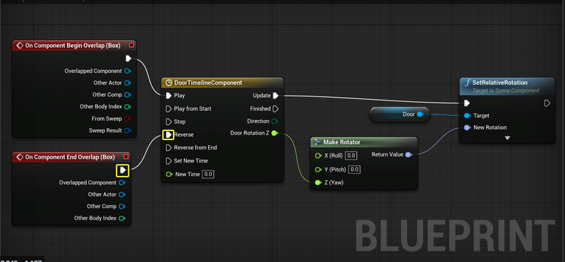

## CRUD Generator

### Introduction

Le but de ce service est de proposer une interface qui permettrai de générer automatiquement toutes les opérations de CRUD
pour un modèle de base de données particulier dans un langage particulier.

### Workflow 

Une interface est disponible pour les utilisateurs qui se composent de graphs Eulérien relié par des courbes de Bézier.
Un de ces graphs permettrai d'établir un MPD (Modèle Physique de Données), en associant des sommets entre eux. 

(Image provenant d'Unreal Engine)

À partir de ce graph on pourra simplement l'envoyer au back qui lira les données enregistrées et générera un projet
dans une technologie ciblé avec tous les éléments de bases lié à la technologie en question. En plus il générera tout
les controllers, les services et les repositories associés aux données dans un format lisible par l'homme.

### Fonctionnement du front

Le front sera fortement inspiré des Blueprint de Unreal Engine comme dans la figure 1. Tout fonctionne avec un système de
node interconnectable qui ont un impact les une sur les autres. Les nodes rouges sont celles d'événements et permettent
de commencer une logique.  
On peut imaginer que l'on voudra étendre l'applicatif un peu plus loins que juste du CRUD non paramétré.
On aura quelque chose de similaire in fine pour décrire nos controllers et logique de nos services.

### Fonctionnement du back

Le back va recevoir des tables avec des champs. À partir de là, il pourra aisément générer le projet.
Pour cette première itération, nous ferons de l'écriture de fichier en direct en créant tous les dossiers en fonction du
nom des tables.